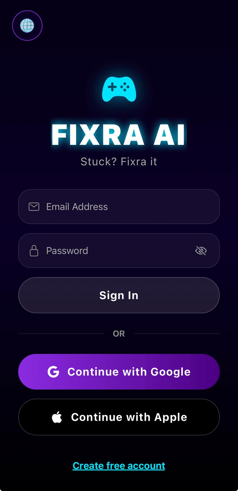
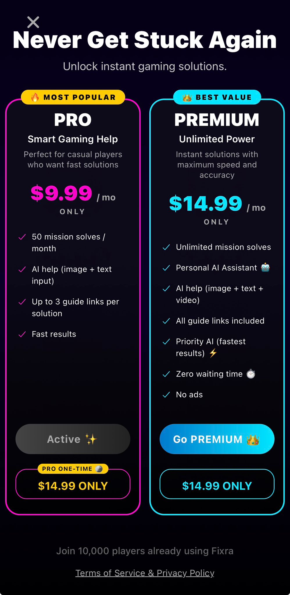
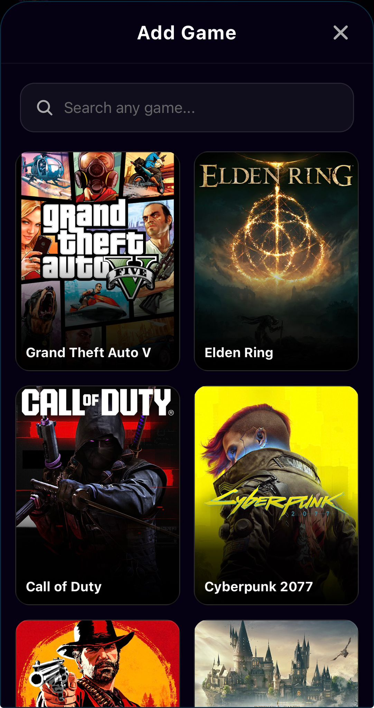
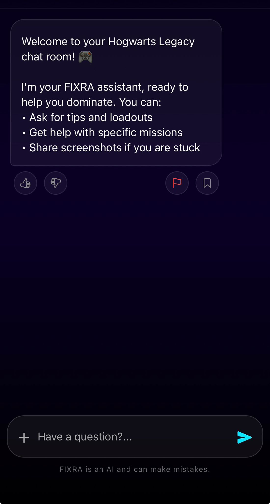
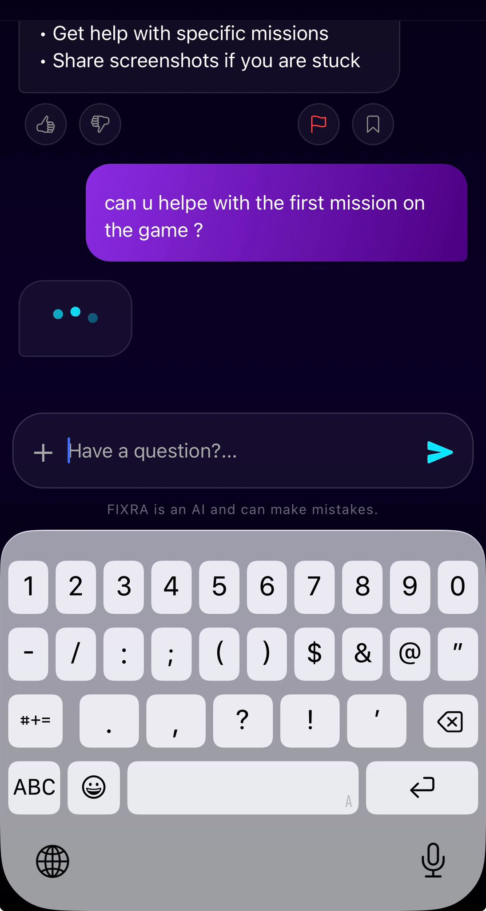
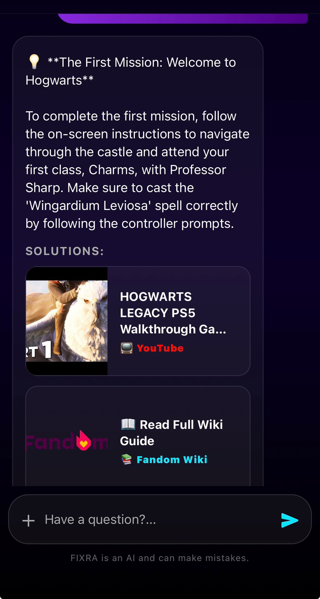

# FIXRA AI

[](https://apps.apple.com/il/app/fixra-ai/id6769673654)





Your personal AI gaming coach, powered by cutting-edge artificial intelligence to help you master your favorite games.

## 📱 Features

- **AI-Powered Gameplay Analysis**: Upload screenshots or video gameplay clips for instant AI analysis and personalized improvement tips
- **Intelligent Chat Assistant**: Get real-time gaming advice powered by advanced AI
- **Game Library**: Browse and explore a comprehensive database of games
- **User Profiles & Settings**: Customize your experience and track your gaming profile
- **Community Connection**: Connect with other gamers in the community
- **In-App Purchases**: Unlock premium features and advanced AI analysis with flexible subscription options
- **Affiliate Program**: Earn rewards by sharing FIXRA AI with friends
- **Interactive Tutorial**: Get started quickly with an interactive onboarding guide
- **Favorites System**: Save your favorite games and tips for quick access
- **Secure Authentication**: Industry-standard authentication powered by Clerk

---

## 🛠️ Tech Stack

- **Frontend Framework**: React Native (Expo)
- **Language**: TypeScript
- **AI Engine**: Google Generative AI
- **Authentication**: Clerk
- **Backend**: Supabase
- **Payment Processing**: RevenueCat
- **Testing**: Jest + React Native Testing Library

### Technical Challenges & Solutions

- **Complex Authentication & Database Flow:** Implemented secure user authentication using **Clerk** seamlessly integrated with a **Supabase** backend, utilizing Edge Functions for webhook processing.
- **AI Integration:** Leveraged **Google Generative AI** to analyze gameplay screenshots and video clips in real-time, providing personalized gaming tips.
- **Monetization Architecture:** Built a robust in-app purchase system with **RevenueCat**, handling subscription states and paywall gating efficiently.
- **Testing & Quality Assurance:** Developed comprehensive unit and component tests using **Jest** and **React Native Testing Library** to ensure high reliability across critical app flows.

---

## 🚀 Getting Started

### Prerequisites
- Node.js 
- npm or yarn
- Expo CLI (`npm install -g expo-cli`)
- iOS/Android development environment (for native builds)

### Running on Specific Platforms

- **iOS**: `npm run ios`
- **Android**: `npm run android`
- **Web**: `npm run web`

---

## 📁 Project Structure

```
├── src/
│   ├── components/          # Reusable UI components
│   ├── screens/             # App screens
│   ├── services/            # AI and external service integrations
│   ├── context/             # React context providers
│   ├── utils/               # Utility functions and helpers
│   └── types/               # TypeScript type definitions
├── hooks/                   # Custom React hooks
├── supabase/
│   ├── functions/           # Supabase edge functions
│   │   ├── chat/            # AI chat endpoint
│   │   ├── clerk-webhook/   # Clerk auth webhook
│   │   └── revenuecat-webhook/ # Payment webhook
│   └── config.toml          # Supabase configuration
├── assets/                  # App icons, splash screens, etc.
└── package.json             # Dependencies and scripts
```

---

## 🧪 Testing

Run the test suite:
```bash
npm test
```

Tests are located alongside their respective modules:
- `*.test.ts` - Unit tests
- `*.test.tsx` - Component tests

---

## 🔧 Key Components

### Screens
- **ChatScreen**: Main AI chat interface
- **LoginScreen**: User authentication
- **SettingsScreen**: User preferences
- **FavoritesScreen**: Saved games and tips

### Components
- **MessageBubble**: Chat message display
- **ChatInputArea**: Message input interface
- **PaywallModal**: Premium feature unlock
- **TutorialModal**: Interactive onboarding
- **GameLibraryModal**: Game selection interface

### Services
- **aiService**: Google Generative AI integration
- **db**: Supabase database operations
- **tokenCache**: Secure token management

---

## 📦 Dependencies Highlights

- `@google/generative-ai`: AI chat and analysis capabilities
- `@clerk/clerk-expo`: Secure user authentication
- `@supabase/supabase-js`: Backend database and APIs
- `react-native-purchases`: In-app purchase management
- `expo-image-picker`: Photo and video upload functionality
- `expo-crypto` & `expo-secure-store`: Secure data storage

---

## 📋 Build & Deployment

### Development Build
```bash
eas build --platform ios --profile preview
```

### Production Build (App Store)
```bash
eas build --platform ios --profile production
```

---

## 🤝 Contributing

For internal development, ensure:
- All tests pass before submitting PRs
- TypeScript strict mode compliance
- Component documentation with JSDoc comments
- Following the established project structure

---

## 📄 License

This project is proprietary software. All rights reserved.
Developer : Fixra Group

---

## 📞 Support

For support or inquiries, please contact the development team : fixra.partners@gmail.com .

---

**Last Updated**: June 2026  
**Current Version**: 1.0.0  

